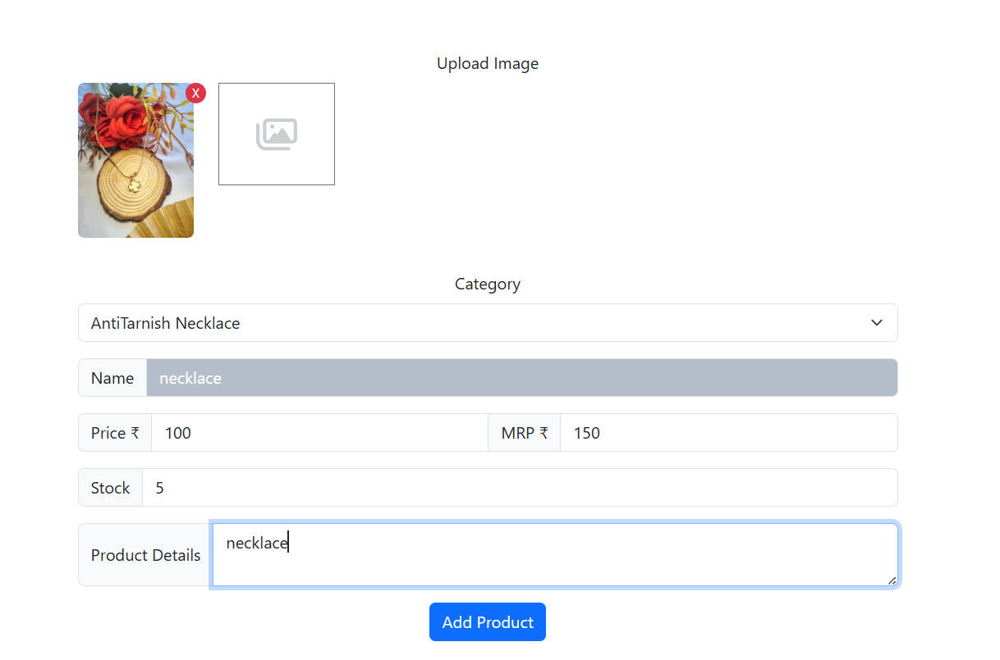
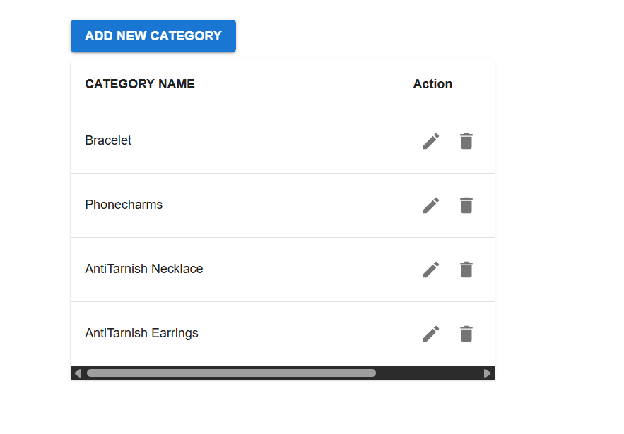

# E-commerce Website using MERN Stack

## Project Overview
This is a fully functional **E-commerce website** built using the **MERN stack** (MongoDB, Express.js, React.js, Node.js).  
The project demonstrates core **MERN concepts**, including **user authentication using JWT**, **email verification**, and an **admin panel** for managing products and categories.

---

### Technical Features
- **Frontend:** React.js for dynamic and responsive UI
- **Backend:** Node.js & Express.js REST APIs
- **Database:** MongoDB for storing users, products,cart and categories
- **Security:** JWT authentication and email verification

---

## Implementation

https://github.com/user-attachments/assets/5d19751c-5cc1-4007-9404-18f867df0b0a

### Admin Product Management

### Admin Products Overview

### Admin Add Category

---

## Concepts Covered
- MERN stack development workflow  
- REST API integration  
- JWT authentication & email verification  
- Admin panel management  

